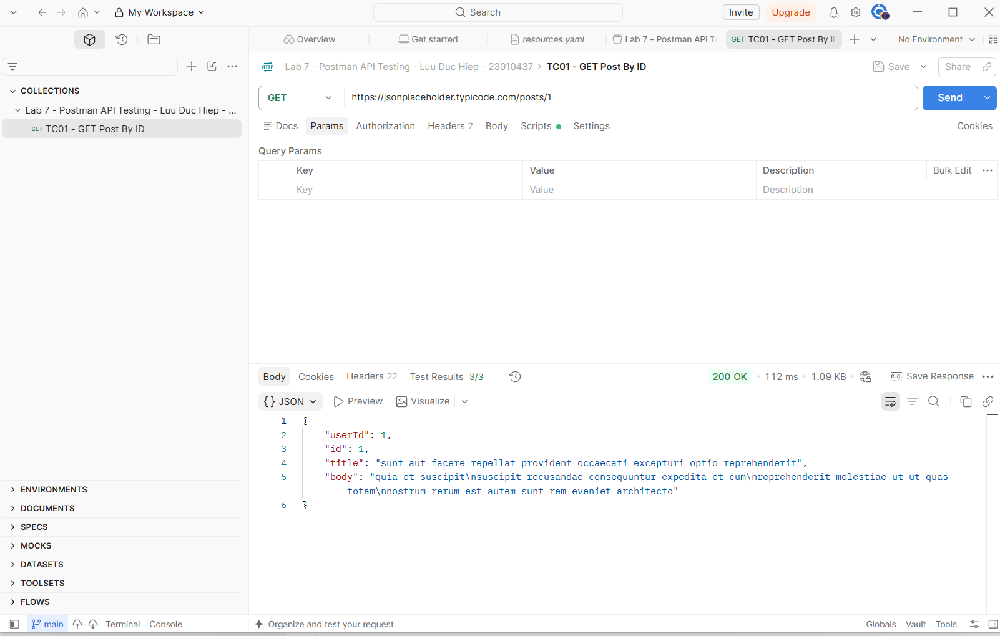
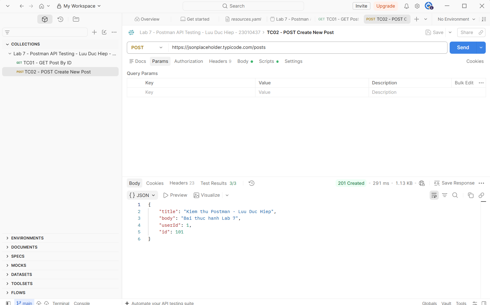
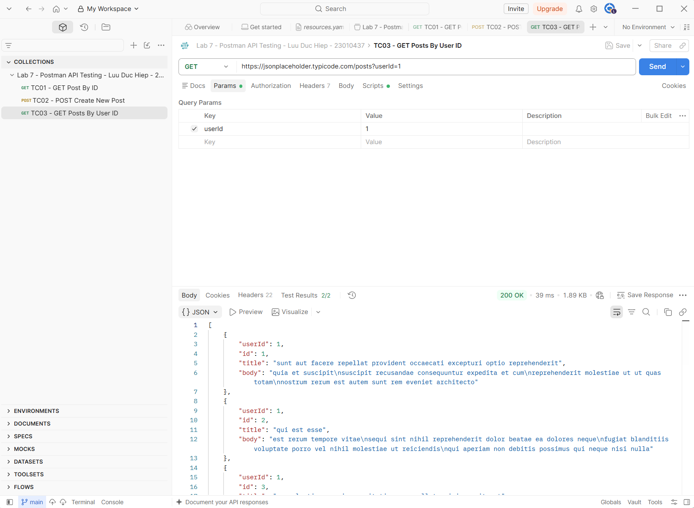

# LAB 7 - KIỂM THỬ REST API VỚI POSTMAN

## Thông tin sinh viên

- **Họ và tên:** Lưu Đức Hiệp
- **Mã sinh viên:** 23010437
- **Môn học:** Đánh giá và kiểm định chất lượng phần mềm
- **Công cụ:** Postman

## 1. Mục tiêu

Bài thực hành sử dụng Postman để tạo và chạy các kịch bản kiểm thử REST API. Bộ kiểm thử thực hiện các phương thức HTTP phổ biến, kiểm tra mã trạng thái, cấu trúc dữ liệu JSON, dữ liệu phản hồi và thời gian đáp ứng.

API được kiểm thử:

```text
https://jsonplaceholder.typicode.com
```

## 2. Danh sách kịch bản kiểm thử

| STT | Tên request | Phương thức | Endpoint | Kết quả |
|---|---|---|---|---|
| 1 | TC01 - GET Post By ID | GET | `/posts/1` | 200 OK, 3 test đạt |
| 2 | TC02 - POST Create New Post | POST | `/posts` | 201 Created, 3 test đạt |
| 3 | TC03 - GET Posts By User ID | GET | `/posts?userId=1` | 200 OK, 2 test đạt |

## 3. Kết quả thực thi

Bộ kiểm thử đã được chạy trực tiếp trong Postman:

- **Requests:** 3/3 thành công
- **Assertions:** 8/8 đạt
- **Failed:** 0
- **Tỷ lệ thành công:** 100%

## 4. Minh chứng thực hiện

### 4.1. Kiểm thử GET request



### 4.2. Kiểm thử POST request



### 4.3. Kiểm thử GET với query parameter



## 5. Kiến thức áp dụng

- Tạo collection và request trong Postman.
- Gửi request GET và POST với query parameter và JSON body.
- Viết test script bằng `pm.test` và `pm.expect`.
- Kiểm tra status code, response time, Content-Type và response body.
- Lưu và tổ chức các request trong cùng một collection.

## 6. Tài liệu tham khảo

- [Video hướng dẫn Postman trong đề bài](https://www.youtube.com/watch?v=MFxk5BZulVU)
- [JSONPlaceholder](https://jsonplaceholder.typicode.com/)
